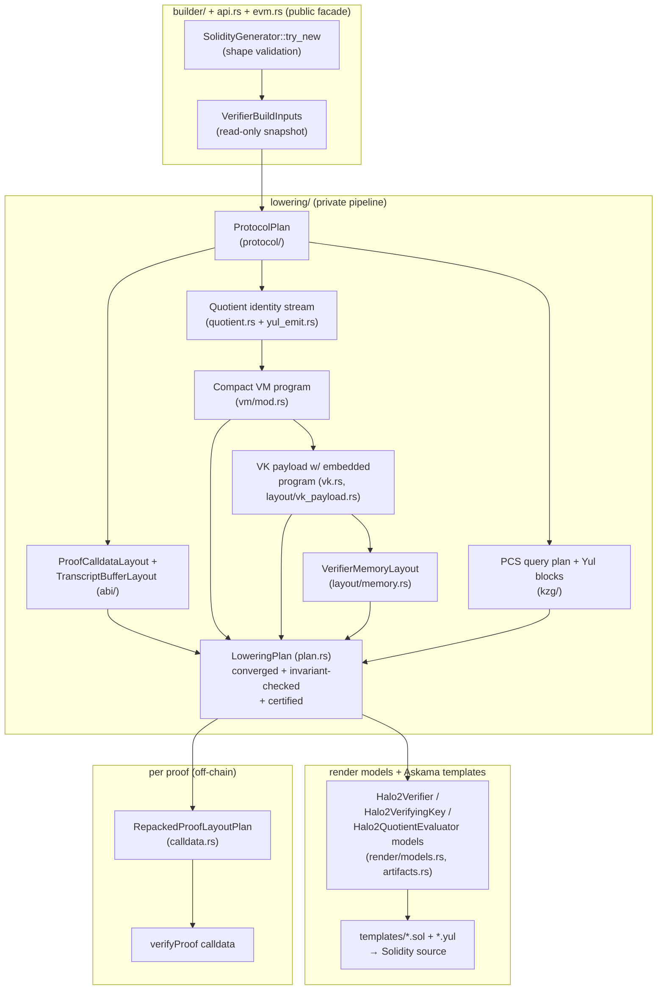

# Halo2 Solidity Verifier Code Generator — Architecture Review

> Independent as-built architecture review, produced 2026-08-08 against the
> `misc-fixes` branch. This document describes the system as it exists in the
> source tree, from a full multi-reviewer pass over every module; it is a
> snapshot, not a maintained spec. The maintained specification is
> [`LOWERING_ARCHITECTURE_SPEC.md`](./LOWERING_ARCHITECTURE_SPEC.md);
> design-choice notes are in [`ARCHITECTURE.md`](./ARCHITECTURE.md). The
> companion assessment and redesign proposals are in
> [`../plans/REDESIGN_PROPOSALS_2026-08.md`](../plans/REDESIGN_PROPOSALS_2026-08.md).
> Reported line numbers and counts are as of this snapshot; verify against
> current sources before relying on them.

## 1. What this crate is

`halo2_solidity_verifier` is a **code generator**, not a verifier library. It
consumes a `midnight-proofs` verifying key plus BLS12-381 KZG parameters and
emits up to three Solidity contracts:

| Artifact | Role |
| --- | --- |
| `Halo2Verifier.sol` | The verifier: one `verifyProof(bytes,uint256[])` entry point wrapping a single terminal Yul assembly block. |
| `Halo2VerifyingKey.sol` | Optional split VK data contract: runtime bytecode = `0xfe` (INVALID) prefix + the raw VK payload (header words, compact quotient VM constants + bytecode, fixed/permutation commitments). |
| `Halo2QuotientEvaluator.sol` | Optional split quotient evaluator: a `fallback()` that receives a raw verifier memory frame by calldata, re-runs the quotient VM, and returns `[magic, -nu_y(x), selector buckets]`. |

It also provides the off-chain per-proof shim: `repack_proof` /
`encode_calldata` convert a native compressed proof (48-byte G1s, LE scalars)
into the EIP-2537-padded big-endian calldata the generated verifier reads.

The supported protocol envelope is deliberately narrow and validated up
front: Midfall/Midnight KZG proofs on BLS12-381, exactly one identity-committed
instance column plus one non-committed public-input column, no rotated instance
queries, at least one advice column, Keccak transcript, optional IVC
accumulator tail in radix-2^56 limbs (7 limbs × 56 bits, 4 limbs per word).
The generator emits exactly **one verifier shape** — there is no runtime
configurability in the artifact; every knob is resolved at generation time.

Scale at this snapshot: ~35k lines of Rust (of which ~8.6k are tests inside
`src/`), ~3.8k lines of Askama templates, 18 template files, 37 documentation
files, 2 libFuzzer targets, 7 integration test files, and committed replay
fixtures for IVC and Moonlight-wrap shapes.

## 2. System at a glance



Two properties define the architecture:

1. **Layout-first, plan-once.** The generated Yul uses absolute memory
   addresses and packed bytecode sections, so *every* address, offset, count,
   and byte length is computed and validated in Rust before a single template
   line renders. One converged `LoweringPlan` per `render()` call feeds the
   verifier, the VK, and the quotient evaluator, so one call can never emit
   artifacts from divergent plans (`src/builder/render.rs:34`).
2. **Templates consume facts.** Askama templates receive already-planned data
   (pointers, counts, code-line vectors, opcode tables) and are forbidden by
   convention from re-deriving layout. Every template constant traces to a
   single Rust definition via `TemplateConstants` / `VkHeaderTemplateSlots`.

## 3. Layering and dependency rules

```
src/lib.rs            public exports, feature constants
src/api.rs            public config/error/diagnostic types (no codegen logic)
src/builder/          thin validating facade: SolidityGenerator
  api.rs                try_new + shape validation, diagnostics entry points
  render.rs             render(RenderOptions) → RenderedArtifacts
  repack.rs             repack_proof / encode_calldata wrappers
src/lowering/         private pipeline (all pub(crate))
  protocol/             typed ProtocolPlan from the constraint system
  abi/                  proof calldata + transcript buffer layout
  encoding/             ConstraintSystemMeta, Data, Ptr/Word/EcPoint handles,
                        EIP-2537 encoders
  layout/               memory planner, VK header/payload section maps
  quotient.rs           quotient identity planning + routing + selector folds
  quotient_numerator/   yul_emit.rs (identity Yul emitter),
                        vm/ (compact VM compiler, validators, reference
                        interpreter, certifier)
  kzg/                  PCS multi-open planner and Yul emitter
  plan.rs               LoweringPlan: convergence + cross-module invariants
  vk.rs                 VK payload generation, convergence loops
  artifacts.rs          Askama model assembly
  render/               models.rs (dumb template carriers + validators)
  calldata.rs           proof repacking
  diagnostics.rs        host-side manifests/counts
src/evm.rs            calldata ABI encoder; pinned-solc + revm harness (evm feature)
templates/            Askama contract templates + partials
```

Dependency rules that hold in the imports (verified, not just documented):

- `builder` → `lowering` only; **zero** reverse dependencies from `lowering`
  into `builder`.
- All pipeline entry points are methods on `VerifierBuildInputs`, a `Copy`,
  read-only snapshot of the generator's borrowed state
  (`src/lowering/mod.rs:36`).
- `render/models.rs` structs are dumb carriers; planning types do not depend
  on Askama.
- Templates reach Rust constants only through model fields; opcode/token bytes
  come from `QUOTIENT_VM_SPEC` (`src/lowering/quotient_numerator/vm/mod.rs:908`),
  the single ABI description shared by emitter, validators, tests, and
  template rendering.

## 4. The lowering pipeline, stage by stage

### 4.1 Constructor validation (`builder/api.rs`)

`SolidityGenerator::try_new` rejects, with typed `GeneratorError`s: missing
advice columns, any instance-column split other than 1 committed + 1
non-committed, invalid accumulator limb schema (only 7×56 supported),
accumulator fixed-base scalar tails outside
`[1 + num_permutation_comms, 1 + num_permutation_comms + num_fixed_comms]`
(which would otherwise alias arbitrary VK payload words as G1 bases),
rotated instance queries, and any constraint-system shape
`ProtocolPlan::validate` refuses (~15 cross-field invariants, e.g. an advice
column absorbed but never opened). `new()` is the panicking wrapper.

### 4.2 Protocol planning (`protocol/`)

`ProtocolPlan::try_from_constraint_system` derives the typed source of truth:
commitment/eval read order in transcript order, the PCS query schedule (ending
in a synthetic Linearization query), per-family quotient identity counts,
phase remappings, the simple-selector column set, common-poly needs, and trace
IDs. Everything downstream — proof ABI, transcript sizing, quotient stream,
PCS sets — is derived from this plan, and `ConstraintSystemMeta` carries its
scalar summary with a `validate_against_protocol` cross-check.

### 4.3 Proof ABI (`abi/proof.rs`)

`ProofCalldataLayout` replays the protocol commitment order into byte offsets
(per-phase advice, lookup m/helpers/accumulators, permutation products, trash,
quotient limbs, evals, `f_com`, q_eval sets, public inputs), asserting order
drift. `TranscriptBufferLayout` conservatively sizes the streaming Keccak
buffer (largest absorb run between squeezes, at 128 bytes per uncompressed G1)
— this bound decides `VK_MPTR`, and an under-estimate would let the transcript
buffer overrun the VK region mid-verify (the comment at
`src/lowering/vk.rs:437` records exactly this historical bug class).

### 4.4 Quotient identity planning (`quotient.rs`, `yul_emit.rs`)

The `yul_emit::Evaluator` walks gates, permutation, lookup (LogUp), and trash
arguments in the canonical `partially_evaluate_identities` order, emitting
per-identity Yul lines **and** a typed `QuotientExpr` tree per identity, each
tagged `Main` (folds into the numerator accumulator) or `Selector(i)` (folds
into a simple-selector bucket). `quotient_program_plan` then routes each
identity to one of four execution representations:

| Representation | What | Why |
| --- | --- | --- |
| Inline Yul prefix | First `DEFAULT_HYBRID_QUOTIENT_INLINE_IDENTITIES = 4` gates | Straight-line speed for the cheap head |
| Compact VM bytecode | Bulk of the identities | Code size: bytecode lives in the VK payload, not the verifier runtime |
| Native Yul callbacks | Knapsack-selected heavy gates (`DEFAULT_QUOTIENT_NATIVE_GATES = 4` budget) + the whole permutation/lookup families | Gas: loops with scratch tables beat interpretation for heavy shapes |
| Structured trash tail | Trash identities | Compressed fixed-shape tail |

`validate_execution_manifest` re-expands the routed plan back to a flat
per-identity stream and proves position-by-position equality of index, source,
and target against the original — the routing is provably order-preserving.
`selector_fold_plan` computes per-bucket y-power gaps/tails so selector buckets
fold sparsely. Cost models used by the knapsack are explicitly documented as
proxies whose divergence cannot affect correctness.

### 4.5 Compact quotient VM compilation (`quotient_numerator/vm/`)

`QuotientProgramBuilder` lowers `QuotientExpr` trees into a byte-oriented
program plus a deduplicated Fr constant table: constant pooling (u16 slots with
a u8 fast path), stack-depth accounting, peepholes (pow5, fused add-mul
accumulators), and **structural** shape recognizers that rewrite 7-limb
foreign-field algebra (LIN7 / BILIN7 / MODARITH7 shapes) and affine sums into
superinstructions; a run-compaction pass turns ≥4 adjacent fused terms into
counted `RUN_*` opcodes. Recognizers never dispatch on gate names and always
have a value-equal generic fallback.

The finalized bytecode passes a three-stage offline validator
(decode/operand-bounds/stack-effects; const-slot bounds; memory-pointer
whitelist against a `QuotientReadModel` of exactly the windows the verifier
populates), then two certification passes (§8).

### 4.6 VK payload and convergence (`vk.rs`, `layout/vk_payload.rs`)

The VK payload is a monotonic section map: 31-word header (digest, domain
constants, accumulator config, EIP-2537 G1/G2/−sG2 base points) built by a
checked `VkHeaderBuilder`, quotient constants, packed quotient program
(big-endian U256 words, padding verified on decode), fixed commitments,
permutation commitments.

Two bounded fixed-point loops resolve circular size dependencies, failing
loudly on non-convergence:

- `generate_vk` (≤8 iterations): program size depends on memory addresses,
  which depend on VK length — reserve zero-filled sections, recompile, repeat
  until the reservation covers the program.
- `meta_data_for_stable_static_layout` (≤3 iterations): `VK_MPTR` must sit
  above the low-memory working set (transcript buffer, PCS scratch, pairing
  frames, return buffers), which itself depends on planned metadata (including
  the two-pass dummy-eval/point-set planning for `outer-fewer-point-sets`).

`generate_base_vk` also asserts at build time that the SRS G1 base (sum of
`g_lagrange`) equals the canonical generator — otherwise the emitted `G1_BASE`
would diverge from the commitment base and the contract would enforce a
different pairing equation than the native verifier (`src/lowering/vk.rs:74-92`).

### 4.7 Memory planning (`layout/memory.rs`)

Because the generated Yul never uses the free-memory pointer for its main work
areas, `VerifierMemoryLayout::new` registers ~30 named regions in a
`MemoryArena`: fixed low-memory frames at `LOW_MEMORY_SCRATCH_START = 0x1000`
(transcript buffer, return words, pairing scratch, constructor smoke),
permanent bands (VK payload, challenges, theta window, decoded evals,
decompressed commitments), and phase-scoped scratch (batch inversion, quotient
VM stack, PCS tables/MSMs, accumulator MSM). Each region carries a lifetime:
`Permanent`, `Phase(p)`, or `PhaseSpan(a..=b)` over a 16-variant `MemoryPhase`
enum declared in verifier runtime order — the derived `Ord` is what makes
`MemoryLifetime::intersects` meaningful. `validate()` pins fixed pointers,
rejects regions below 0x1000, checks PCS window capacities (rotation points
≤ 28, x1 powers ≤ 65, q_eval sets ≤ 56), and runs pairwise overlap checking
gated by lifetime intersection — so intentional scratch aliasing across
disjoint phases is declared and machine-checked rather than coincidental.

The 0x80–0x1000 band is deliberately left to solc: the terminal assembly block
carries a *factually false* `("memory-safe")` annotation (required to compile
without stack-too-deep), and disjointness from solc's via-IR spill window is
established by testing the compiled bytecode's memoryguard against the layout
(observed spill reservations up to 0x8e0; see §8 and the companion assessment).

### 4.8 PCS planning and emission (`kzg/`)

The KZG multi-open lowering mirrors `midnight-proofs` `multi_prepare`:
`queries()` resolves the typed plan sources to concrete memory handles;
optional dummy-query augmentation collapses rotation sets
(`outer-fewer-point-sets`); `construct_intermediate_sets_impl` simulates the
prover's set construction (dedup by pointer identity, cardinality-sorted);
`memory_requirements` sizes the scratch windows; `computations()` emits six Yul
blocks — rotation points `x·ω^rot`, x1 powers (rolled loop, optional 128-bit
truncation), per-set q_eval folds (rolled when >4 sets), `f_eval` via Horner
with a single-modexp Montgomery batch inversion, the fused final G1MSM through
precompile 0x0c, and pairing inputs `(π, final_com − v·G + x3·π)`.

`validate_absorbed_g1_precompile_coverage` machine-checks the crate's central
soundness delegation: **every** proof G1 absorbed into Fiat-Shamir must later
be consumed by an EIP-2537 G1MSM or pairing input (which subgroup-check),
because the verifier itself never subgroup-checks; `G1ADD` (which does not) is
only ever applied to precompile outputs.

### 4.9 Render models and templates (`render/models.rs`, `artifacts.rs`, `templates/`)

`artifacts.rs` assembles the three Askama models from the converged plan and
calls their `validate_layout()` / `validate_payload_layout()` before rendering
(pointer/count cross-checks against the typed layouts, external-frame
containment, EIP-170 bound on the VK runtime). Templates are organized as one
contract shell per artifact plus partials in phase order: precompile smoke,
constructors (2×2: embedded/split VK × inline/external quotient, pinning
dependencies by `code.length` **and** `codehash`), VK loading + full ABI
calldata-shape validation, transcript parser, Lagrange block, quotient block
(dual-mode: inline VM or external staticcall over a raw frame), PCS injection,
accumulator batching, final pairing, trace/return.

### 4.10 Per-proof repacking (`calldata.rs`, `evm.rs`)

`repack_proof` decompresses each 48-byte G1 (rejecting invalid points),
pads to the 128-byte EIP-2537 form, rewrites LE scalars into canonical BE
words (rejecting non-canonical Fr with typed `RepackError`s carrying byte
offsets and hex payloads), preserving exactly the generator's group ordering;
`evm::encode_calldata` wraps the result in the `verifyProof(bytes,uint256[])`
ABI (selector `0x1e8e1e13`).

## 5. Design decisions and their rationale

1. **Narrow supported envelope, validated up front.** The generator refuses
   at construction what the templates cannot verify at runtime. This converts
   a whole class of "generated verifier silently wrong" into "generation
   fails with a typed error."
2. **Static absolute memory layout.** Predictable, cheap Yul (no FMP
   bookkeeping), auditable addresses, and a planner that can *prove*
   non-overlap. The cost: the planner is load-bearing for memory safety, and
   the 0x80–0x1000 solc band must be established out-of-band (§4.7).
3. **Compact quotient VM in the pinned VK payload.** The quotient block was
   the dominant contract-size contributor (straight-line Yul put the IVC
   verifier over EIP-170). Moving identity programs into VK data and
   interpreting them trades gas for size; macro/run opcodes and limb
   superinstructions claw the gas back (quotient section: 2.58M → 1.05M gas;
   verifier runtime: 30,278 → ~12k bytes, each artifact below 24KB).
4. **Pinning by runtime length + codehash, both at construction and per
   call.** The verifier accepts exactly one VK runtime hash and (in split
   mode) one quotient evaluator hash. Deployment is a two-phase flow (render
   evaluator → compile/deploy → re-render verifier with `ExternalPinned`);
   the older unpinned APIs deliberately panic.
5. **Bounded convergence instead of two-pass guesswork.** Circular size
   dependencies are resolved by explicit fixed-point loops that fail loudly,
   and `LoweringPlan::new` re-checks the cross-module invariants convergence
   was supposed to establish — including a *word-for-word* comparison of the
   VK-embedded quotient constants/bytecode against an independently
   recompiled build (`src/lowering/plan.rs:307-329`).
6. **Render-time certification of emitted bytecode** (§8). Optimizers are
   checked per artifact, not trusted: a recognizer bug on an unseen gate
   shape fails the render instead of shipping a wrong verifier.
7. **Subgroup checks delegated to EIP-2537 under a machine-checked coverage
   invariant** (§4.8), with a constructor smoke test that fails deployment on
   forks without the precompiles.
8. **One verifier shape per build.** Feature flags (`truncated-challenges`,
   `outer-fewer-point-sets`, `outer-single-h-commitment`) select codegen
   behavior at compile time; the artifact has no runtime configuration
   surface. (The flip side — the artifact records its feature profile
   nowhere — is assessed in the companion document.)

## 6. The generated runtime

Execution order of a rendered verifier (each phase maps to a template partial
and a `MemoryPhase` variant):

1. ABI guard: proof head must be exactly `0x40`, instances head pinned, proof
   length, instance count, and **exact** `calldatasize` checked before the
   parser touches a byte.
2. VK load: embedded `mstore`s, or `extcodesize`/`extcodehash` re-check + 
   `extcodecopy` from byte 1 of the pinned VK contract; loaded header words
   cross-checked against generated constants (`num_instances`, `k`,
   accumulator config).
3. Optional accumulator pre-validation: radix-2^56 limb decode (injective;
   canonical identity encoding; packing canonicality) with every decoded point
   routed through G1MSM for curve/subgroup validation.
4. Streaming Keccak transcript: absorb VK digest, identity committed-PI
   (128 zero bytes), instance count + canonicality-checked instance scalars,
   then per-phase advice G1s (128-byte padded form) interleaved with
   challenge squeezes (theta, beta/gamma, trash, y, x, x1..x4; optional
   128-bit truncation); evals spill to `REVERSED_EVALS_MPTR`; final
   `proof_cptr == NUM_INSTANCE_CPTR` consumption check.
5. Lagrange block: `x^n` by squaring, denominator batch-inversion
   (fail-closed on non-canonical words / failed modexp), `L_i(x)`,
   `instance_eval`.
6. Quotient numerator: interpret the pinned VM bytecode (cached-top-of-stack
   interpreter; only the opcode cases the program uses are rendered; unknown
   opcodes revert; terminal `q_pc`/`q_has_top`/`q_sp` balance checks) plus
   native permutation/lookup/heavy-gate kernels; or staticcall the pinned
   external evaluator with a raw memory frame, checking returndata size and a
   magic word. Result: `-nu_y(x)` at `QUOTIENT_EVAL_MPTR`.
7. PCS blocks 1–6 (§4.8) ending in `PAIRING_LHS`/`PAIRING_RHS`.
8. Optional accumulator batching: Keccak-derived alpha (zero remapped to 1)
   folds the carried accumulator equation into the pairing inputs via
   G1MSM + G1ADD.
9. Two-pair pairing via `ec_pairing` (MCOPY-staged, result compared
   `eq(..., 1)`); `mstore(RETURN_MPTR, 1)`; return.

Every staticcall checks success **and** exact returndatasize; every scalar
ingress is canonical-Fr-checked; every G1 coordinate checks the 16-byte pad
and `coord < p`. Failure direction is uniformly revert.

## 7. Trust and assurance architecture

The correctness argument is a chain with explicitly different assurance per
leg (honestly documented in `LOWERING_ARCHITECTURE_SPEC.md` §12.1 and
`vm/reference.rs`):

| Leg | Mechanism | Strength |
| --- | --- | --- |
| Identity expressions → VM bytecode | Render-time: 3-stage validator; `certify_quotient_program` executes finalized bytecode on an **independent reference interpreter** at an artifact-seeded challenge vs direct `QuotientExpr` evaluation; `certify_quotient_builds_agree` dual-builds with recognizers disabled and requires identity-by-identity agreement; VK-embedded words re-compared word-for-word | Per-render, machine-checked |
| Bytecode → Yul interpreter semantics | Opcode/token table conformance tests (a `case` exists per opcode) + native-vs-Solidity per-identity trace differentials on fixture circuits | Fixture-sampled; an opcode no fixture emits has unverified runtime semantics |
| Inline/native/tail identities (never bytecode) | Trace differentials only | Fixture-sampled |
| Pointer bindings wrong-in-both-representations | `validate_quotient_mem_ptrs` whitelist (certification can't catch these: a pointer wrong in both sides agrees with itself) | Per-render |
| Memory non-overlap | Lifetime-aware `MemoryMap::validate` per render; *registered-regions-only* — agreement between emitted Yul and registered regions is pinned by rendered-source tests | Per-render + tests |
| solc spill window vs 0x1000 layout | Compiled-bytecode memoryguard test (env-gated) | Test-time only, one pinned compiler |
| EIP-2537 semantics (incl. subgroup checks) | Assumed per spec; constructor smoke proves existence/arithmetic, not rejection behavior | Assumed |
| Transcript equivalence with native verifier | Byte-for-byte mirror + trace differential + real-proof fixtures | Fixture-sampled |

Complementing this, the adversarial test tiers: proof/VK/calldata mutation
PBTs, per-offset G1 canonicality/off-curve rejection sweeps cross-checked
against the native verifier, batch-invert fail-closed harness on extracted
generated Yul, EIP-170 fit, a 7-case supported-shape fuzz matrix with
cross-wiring rejection, SRS-free replay fixtures with gas-based stage
attribution, and two libFuzzer targets. (Which of these actually run in CI is
a finding in the companion assessment.)

## 8. Cross-cutting contracts

Things that must stay in sync, and how they currently are:

| Contract | Mechanism |
| --- | --- |
| Quotient VM opcode/token bytes ↔ Yul interpreter | One `QUOTIENT_VM_SPEC` constant feeds emitter, validators, template constants, conformance tests |
| VK payload section order ↔ runtime `extcodecopy` offsets | Typed `VkPayloadLayout`, validated contiguity, tests |
| Proof read order ↔ transcript absorbs ↔ repacker | All derived from `ProtocolPlan` / `ProofCalldataLayout`; drift asserted |
| `MemoryPhase` enum order ↔ template include order | **Comment-enforced only** (see assessment) |
| Injected Yul code lines ↔ template-scope identifiers | **Naming convention only** (see assessment) |
| `verifyProof` selector + ABI head layout ↔ templates | Constant + duplicated in tests/fuzz targets |
| Feature flags ↔ expected proof schema | **Recorded nowhere in the artifact** (see assessment) |
| Accumulator limb packing ↔ `midnight-circuits` encoder | Mirrored constants (7×56), replay fixtures |

## 9. Feature flags and build modes

`evm` (revm + pinned-solc test harness), `solidity-trace` (LOG1 trace events;
trace renders also switch the external-evaluator staticcall to CALL),
`solidity-gas-checkpoints` (per-section LOG1 gas checkpoints, ~12k gas
overhead), `truncated-challenges` (128-bit x3/x1/x4 truncation — must match
the prover), `in-circuit-fewer-point-sets` / `outer-fewer-point-sets` /
`fewer-point-sets` (dummy-query PCS collapsing, split between recursive and
Solidity-facing proofs), `outer-single-h-commitment` (single-H quotient
layout, outer only), `rust-verifier-trace` (native trace hooks for
differentials). Trace/gas modes must not change verifier semantics; the
schema-changing trio must match the prover's build or all proofs are
(fail-closed) rejected.

## 10. Testing and CI architecture

Three tiers: (1) pure codegen tests (`src/lowering/tests.rs` ~4.0k lines,
`src/builder/tests.rs`) needing no EVM/SRS — VM differentials, manifest
ordering, layout facts, template-text pins; (2) env-gated EVM tests
(`src/test.rs` ~4.6k lines behind `HALO2_SOLIDITY_RUN_EVM_TESTS`, integration
fixtures for Poseidon/SHA/RSA/hybrid-MT, the k=20 IVC decider bench behind
`HALO2_SOLIDITY_RUN_IVC_BENCH`) — prove → render → pinned solc 0.8.30 →
Prague revm with blst-backed EIP-2537 → verify → mutate; (3) SRS-free replay
tests over committed fixtures, libFuzzer targets, bench/deploy scripts
(including live Sepolia deployment records under `deployments/`).

CI (`.github/workflows/ci.yaml`): a default test job (EVM tests self-skip),
an EVM job running `cargo test ... pbt_` + the Poseidon fixture, and a trace
equivalence job; the heavy IVC benches and release size/hash gates live in a
weekly/push-to-main workflow (`solidity_verifier_bench.yml`).

## 11. Documentation landscape

37 files under `docs/{architecture,audit,benchmarks,plans,reference}`: a
bounded, falsifiable correctness claim with named exclusions
(`CODEGEN_ASSURANCE_DOSSIER.md`), a reviewer handoff packet, a rebuild-grade
verifier spec (`HALO2_MIDNIGHT_VERIFIER_SPEC.md`, 1.7k lines), memory-layout
and template-mapping references, reproducible-build manifest with published
runtime hashes, and honest limitation notes (the docs themselves flag the
memory-safe annotation as factually untrue and scope precisely what VM
certification does not prove). Parts of the audit chain have drifted from the
tree; the companion assessment enumerates the drift.

## 12. Summary of architectural character

The macro-architecture is disciplined and verified to hold in the imports:
facade → snapshot → converged plan → declarative render, with fail-closed
seams and unusually good rationale comments. The system's characteristic
strength is that security-relevant assumptions are *checked at generation
time* (SRS base, absorbed-G1 coverage, memory overlap, bytecode
certification, payload re-comparison) rather than trusted. Its characteristic
weakness is the residue of places where **strings and conventions do work
that types should do** (Yul text as an internal IR, comment-enforced enum
ordering, name-coupled injected code lines, five parallel operand decoders),
plus assurance-process gaps (CI test selection, artifact-recorded feature
profiles, panic-vs-Result at the public boundary). Those are quantified, with
verified evidence and prioritized redesign proposals, in
[`REDESIGN_PROPOSALS_2026-08.md`](../plans/REDESIGN_PROPOSALS_2026-08.md).
